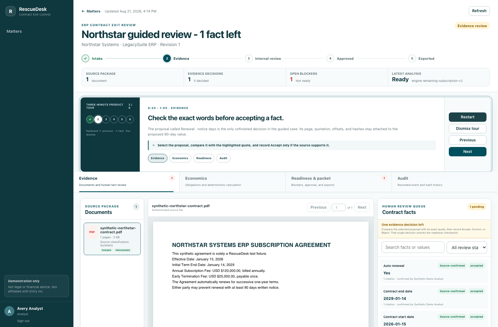

# RescueDesk

RescueDesk is a complete local portfolio demonstration of an evidence-backed ERP contract exit
control room. It turns a public, synthetic, or properly redacted PDF into page-cited facts,
deterministic switching scenarios, explicit blockers, a controlled human-review workflow, and four
hash-linked export formats.

It is an independent project. It is not affiliated with, endorsed by, or sponsored by Entry Inc.
or DualEntry, and it does not provide legal, accounting, or financial advice.



The local demonstration begins with a plain-English three-minute route: make one live decision
against synthetic evidence in the guided case, then compare it with a role-separated approval
example whose approver history and four export formats are seeded synthetic data.

## What is working

- Safe PDF intake with byte hashing, active-content rejection, page extraction, and exact quote
  offsets.
- Deterministic and optional local-Ollama extraction; model output can propose facts but cannot
  calculate, approve, or change evidence.
- Analyst accept/correct/reject decisions with optimistic concurrency, retained review history,
  and lineage-aware labels that keep a changed human value visible as an explicit assumption.
- Exact-money obligation entry for supported zero-, two-, and three-decimal currencies, with
  each active reviewed fee bound to one compatible, unconsumed typed money assertion.
- Versioned `Decimal` calculations with explicit formula IDs, assumptions, blockers, and hashes.
- A role-gated workflow from draft through evidence review, internal approval, and export.
- Controlled finding disposition, recoverable fee/source supersession, retryable document
  processing, and revision cloning after an approved packet is reopened.
- A forward-linked audit ledger covering cases, documents, reviews, fees, calculations, findings,
  transitions, and exports.
- Internal-review PDF, customer explanation PDF, formula-safe evidence CSV, and canonical JSON,
  all derived from one immutable snapshot.
- A responsive Next.js Evidence Workbench for PDF-to-citation review, economics, readiness,
  packet generation, revision history, and audit inspection. Each refresh comes from one
  case-locked aggregate snapshot rather than a mixture of independent reads.
- An accessible in-product tour that explains the problem, user, workflow, and outcome; navigates
  directly among Evidence, Economics, Readiness, and Audit; and supports keyboard, touch, dismiss,
  restart, desktop, and mobile use.

## One-command demonstration

Prerequisite: Docker Desktop.

```bash
docker compose up --build --detach --wait
```

Open [http://127.0.0.1:3000](http://127.0.0.1:3000). The bootstrap migrates PostgreSQL, loads only
the checked-in synthetic Northstar fixture, and creates two replay-safe matters:

- **Northstar guided review - 1 fact left:** exactly one cited 90-day cancellation-notice decision
  remains before internal readiness.
- **Northstar completed exit packet:** zero blockers, seeded synthetic approver-role history, and
  four current formats sharing one packet snapshot hash.

| Role | Email | Password |
|---|---|---|
| Analyst | `analyst@rescuedesk.local` | `DemoPassword!2026` |
| Approver | `approver@rescuedesk.local` | `DemoPassword!2026` |
| Read-only auditor | `auditor@rescuedesk.local` | `DemoPassword!2026` |

Preloaded history is visibly attributed to `Synthetic Demo Analyst` and
`Synthetic Demo Approver`. `Avery Analyst` and `Morgan Approver` are reserved for actions a person
records through the interactive demo accounts above.

The API and interactive documentation are at
[http://127.0.0.1:8000/docs](http://127.0.0.1:8000/docs). All services bind to loopback.

```bash
docker compose ps
docker compose logs api
docker compose down
```

For this synthetic demo only, `docker compose down --volumes` resets the database and runtime
artifacts. Do not use that command for an environment containing data that must be retained.

## Verification

```bash
cd backend
uv sync --all-groups --locked
uv run ruff check .
uv run ruff format --check .
uv run mypy src/rescue_desk
uv run alembic upgrade head
uv run pytest --cov=rescue_desk --cov-report=term-missing --cov-fail-under=90
uv run alembic check

cd ../frontend
npm ci
npm run lint
npm run typecheck
npm test
npm run build
npm run test:e2e
```

The Playwright suite drives the real Docker API and UI on desktop Chromium and a Pixel 7 viewport.
It verifies authenticated PDF rendering, evidence synchronization, exact scenario figures,
the guided tour, one-action readiness, the seeded completed export inventory, audit details,
keyboard-accessible controls, serious/critical axe findings, and page-level horizontal overflow.
Its stateful path also drives a unique synthetic
matter through upload, processing, review, fee correction, calculation, approval, all four exports,
download, exported state, and explicit reopen. Controlled mutation cases use unique synthetic names
so the checked-in Northstar demonstration remains reproducible.

## Architecture

```text
untrusted PDF
    -> safety and byte integrity
    -> immutable pages and evidence spans
    -> machine proposals
    -> human review
    -> deterministic exact-money calculation
    -> readiness and approver gate
    -> immutable export snapshot
       -> internal PDF / customer PDF / evidence CSV / canonical JSON
```

The FastAPI/SQLAlchemy/Alembic backend and Next.js/React/TypeScript frontend deploy as three
non-root local containers with PostgreSQL. Runtime documents and exports share one persistent
volume so an API-container recreation cannot strand artifact metadata from its bytes.

## Repository map

```text
backend/                 API, domain rules, extraction, migrations, exports, tests
frontend/                Evidence Workbench, component tests, Playwright browser tests
fixtures/contracts/      deterministic synthetic PDFs and ground truth
scripts/                 deterministic fixture generator
docs/                    product, architecture, calculations, data, security, demo, recovery
docker-compose.yml       loopback-only PostgreSQL, API, and web demonstration
.github/workflows/ci.yml backend, frontend, migration, coverage, and container gates
```

Start with [docs/DEMO.md](docs/DEMO.md) for the walkthrough,
[docs/ARCHITECTURE.md](docs/ARCHITECTURE.md) for system boundaries, and
[docs/PRIVACY-THREAT-MODEL.md](docs/PRIVACY-THREAT-MODEL.md) before using any document.

## Truth boundary

- A parsed value is not a reviewed fact.
- A human-supplied correction that changes the cited value is an explicit assumption, not
  source-confirmed evidence.
- A scenario is not a promise of credit, savings, eligibility, enforceability, or action.
- An exported file is not approved unless its immutable snapshot contains an approver-role event.
  The prebuilt completed case uses seeded synthetic approver-role history; only an actual operator
  action should be described as human approval.
- A superseded source or fact remains visible and is marked as superseded.
- Only synthetic, public, or properly redacted PDFs belong in this demonstration.
- No email, CRM, contract, external program, or third-party account is changed by RescueDesk.
- No customers, adoption, production deployment, or external outcomes are claimed.
